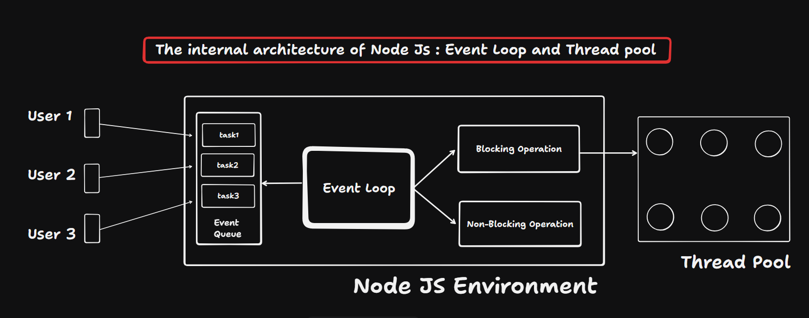

# Event Loop and Thread Pool

NodeJS uses an event-driven architecture to handle tasks efficiently. It relies on the Event Loop and a Thread Pool to manage synchronous and asynchronous operations.

## Synchronous Tasks

- Executed directly on the main thread.
- Block execution until completion.
- Control returns only after the task finishes.

## Asynchronous Tasks

- Delegated to background workers (Thread Pool) or system APIs.
- Do not block the main thread.
- Once completed, their callback is placed in the event queue.

## Thread

- A thread is the smallest unit of execution inside a program.
- It runs code independently within a process.
- In NodeJS:
  1. The main thread runs JavaScript code line by line.
  2. Worker threads in the Thread Pool handle heavy background tasks.

## Thread Pool

- Managed internally by NodeJS through libuv.
- Handles heavy operations such as:
  - File system tasks
  - Cryptographic operations
  - Compression

- Uses multiple worker threads to perform background operations.
- It keeps assigning tasks to available worker threads until no free thread is left in the pool.
- When a task is completed, the worker thread is released.
- The released thread becomes available to handle a new task.

## Execution Flow

1. The developer runs a NodeJS program.
2. The program executes synchronously, line by line, from top to bottom.
3. The Event Loop continuously checks the task queue.
4. When an asynchronous task is encountered, it is sent to the system.
5. Tasks are processed in FIFO (First In, First Out) order.
6. If the task is synchronous (blocking), it runs on the main thread and blocks execution until it finishes.
7. If the task is asynchronous (non-blocking), it is handled by the Thread Pool.
8. After completion, the callback is added back to the queue.
9. The Event Loop picks the callback and executes it when the main thread is free.
