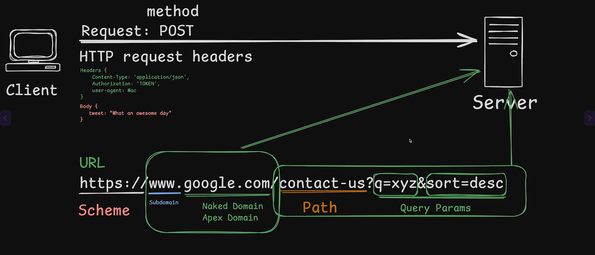

# HTTP Protocol and Servers

- HTTP stands for Hypertext Transfer Protocol and is the set of rules that lets a client and server talk to each other through the internet.
- Client is a machine which makes the request to create, delete, or modify the data stored on the server.
- Server is a machine which listens to requests and serves them accordingly.
  - Server is always available to receive and process requests.
  - Server has a public-facing IP address allocated to it.
  - Before allowing access or modification, it authenticates, authorizes, validates, then processes the request, updates the attached database, and sends a response to the client which created the request.

- The communication cycle between client and server is called the REQUEST-RESPONSE cycle.

## Creating HTTP Server with Node.js

1. Node.js provides a built-in http module.
   To use it, import the module and create a server object.

```js
import http from 'http';

const myHttpServer = http.createServer();
```

2. While creating the server, we can pass a callback function.
   This function receives req and res arguments automatically.

- req object is used to access data and information sent by the client.
- res object is used by the server to send data and response details back to the client.

  ```js
  const myHttpServer = http.createServer((req, res) => {
    console.log(`Request Received: ${req.url}`);
    res.writeHead(200);
    res.end('Hello World, Thanks for visiting myHTTPServer');
  });
  ```

  ```js
  myHttpServer.listen(8080, () => {
    console.log('myHttpServer started listening on Port 8080');
  });
  ```

### HTTP Request URL

- A server listens on a specific port.
- A single server machine can have multiple ports allocated for different services.
- Each service must run on its own allocated port.
- To access a specific service, we must connect using the correct port number.

```text
https://www.example.com/products?pid=1023&name=legion
```



It consists of:

1. Scheme / Protocol : Specifies rules for communication, such as http or https. [https://]
2. Subdomain : Used to organize or separate services (for example, api.example.com).[`www`]
3. Naked domain / Apex domain : Alias for an IP address in the DNS directory and used to locate where the server is hosted. [`www.example.com`]
4. Path : Identifies the specific endpoint on the server. [`/products`]
5. Query parameters : Used to send additional parameters with the request and it start with '?' if multiple parameters are there then they separated with '& [`?pid=1023&name=legion`]'

## HTTP request

- A http request is way for communication made to ask for data form server to client over internet
- Its components are:
  1.  HTTP version type
  2.  URL
  3.  Http Method type
  4.  Http Method headers
  5.  Http method body

### URL

- is used to send the request and where and how to finds the the processor function for it

### HTTP Request type

1. `GET` : is made when a resource or data is being fetched from the server.

- Either matching data is found, then only that dataset is sent back to the client.
- Or if nothing matches, then no value is returned.
- Or there might be an error where the server failed to serve or the request was made in an invalid way.

2. `POST` : is made when a new resource or data is to be created on the server.

- If the creation is successful, the created data and values are returned.
- If not, an error is shown.

3. PATCH : is made when modifying an existing resource or data in which only selected fields are changed.

- If the update is successful, the updated data is returned.
- If the resource is not found, an appropriate response is returned.
- If validation fails or the request is invalid, an error is returned.

4. PUT : is made when replacing the entire resource or data with a new resource or updated data.

- If the replacement is successful, the updated resource is returned.
- If the resource does not exist, it may either create a new one or return an error (depending on server logic).
- If the request is invalid, an error is returned.

5. DELETE : is made when a resource from the server is to be deleted.

- If the deletion is successful, a success response is returned.
- If the resource is not found, an appropriate response is returned.
- If the request is invalid or unauthorized, an error is returned.

## HTTP Method Headers

- Headers are metadata attached to a request.
- They specify properties about the data being sent.
- Headers contain fields that provide additional information about the request.

Common header fields:

- Content-Type → Specifies the type of data being sent (e.g., application/json).
- Authorization → Contains authentication tokens or credentials.
- Accept → Specifies the type of response the client expects.
- User-Agent → Information about the client making the request.

## HTTP Method Body

- The body contains the actual data sent with the request.
- It is mainly used with POST, PUT, and PATCH methods.
- It can contain:
  - Data to create a new resource.
  - Data to update or modify an existing resource.
  - Query data to search or filter results.

```json
{
  "name": "John",
  "age": 25
}
```

## Response Codes

Response codes are sent with the response.
They indicate the status of the request made and show whether it was successful or failed in numerical form.

| Code | Meaning       | Description                                       | Commonly Used                                                              |
| ---- | ------------- | ------------------------------------------------- | -------------------------------------------------------------------------- |
| 1XX  | Informational | Request received, continuing process.             | 100: Continue, 101: Switching Protocols, 102: Processing, 103: Early Hints |
| 2XX  | Successful    | Request was successfully received and processed.  | 200: OK, 201: Created, 204: No Content                                     |
| 3XX  | Redirection   | Further action is needed to complete the request. | 300: Multiple Choices, 301: Moved Permanently, 302: Found                  |
| 4XX  | Client Errors | Error caused by invalid request from the client.  | 400: Bad Request, 401: Unauthorized, 403: Forbidden, 404: Not Found        |
| 5XX  | Server Errors | Error occurred on the server side.                | 500: Internal Server Error, 502: Bad Gateway, 503: Service Unavailable     |
