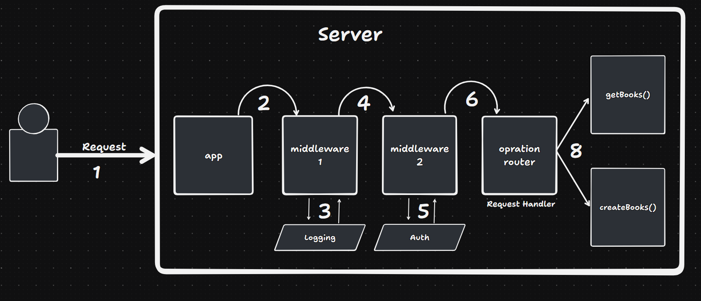
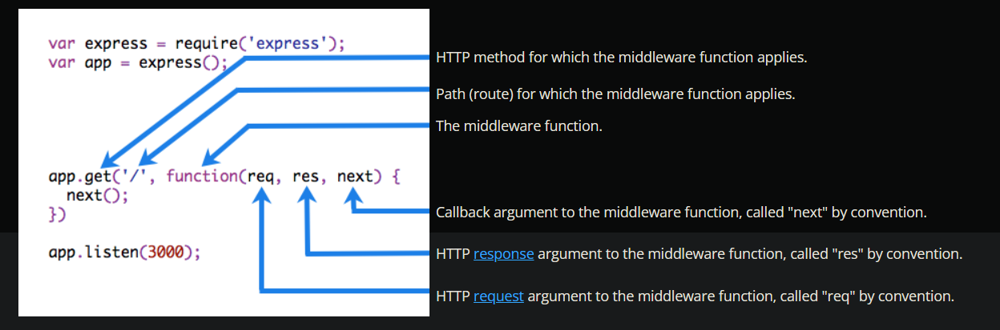

# Middlewares

Middleware functions are functions that have access to the request, response object, and the next function in the application’s request-response cycle. The next function is a function in the Express router which, when invoked, executes the middleware succeeding the current middleware.

Middleware functions can perform the following tasks:

- Execute any code.
- Make changes to the request and the response objects.
- End the request-response cycle.
- Call the next middleware in the stack.

If the current middleware function does not end the request-response cycle, it must call next() to pass control to the next middleware function. Otherwise, the request will be left hanging.



The following figure shows the elements of a middleware function call:



## Types of middleware

1. Global Middleware

- runs every time
- defined in the top bo global space

2. Route level middleware

- runs when a specific path is used

3. Router Middleware

```js
import express from 'express';
import fs from 'node:fs';

const app = express();
const port = 8080;

app.use(express.json());

app.use((req, res, next) => {
  const logLine = `${Date.now()} || ${req.method} || ${JSON.stringify(req.body)} \n`;
  fs.appendFileSync('./log/logs.txt', logLine, 'utf-8');
  next();
});

app.use((req, res, next) => {
  if (req.method === 'GET') next();
  else res.status(404).json({ error: `${req.method} is not allowed` });
});

app.get('/', (req, res) => {
  res.status(200).json({ message: 'OK' });
});

function createRandomNumber(req, res, next) {
  req.randomNumber = Math.floor(Math.random() * 1000000);
  next();
}

app.get('/random', createRandomNumber, (req, res) => {
  res.status(200).json({ randomNumber: req.randomNumber });
});

app.listen(port, () => {
  console.log(`App starts listing on PORT : ${port}`);
});
```
